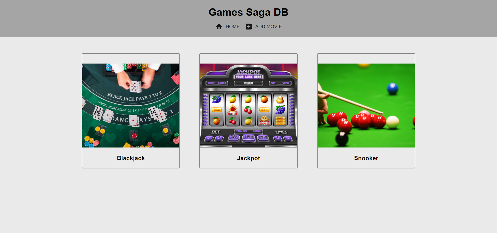
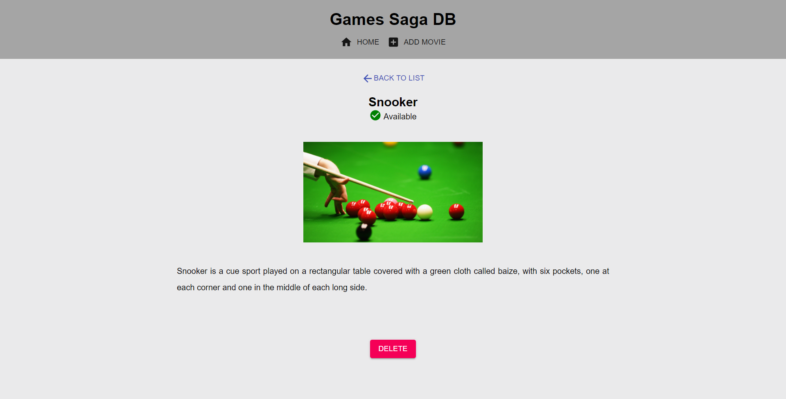
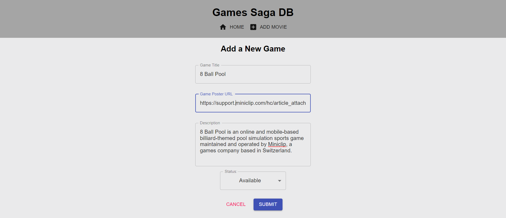

# Games Saga DB

## Description

Games Saga DB developed using Javascript, React.js, Redux, Material-UI, node.js, json-server, axios, restful, Typescript.

## Demo Video

screenshots_demo/demo.mp4

## Demo Snapshots

# `Home/Dashboard Page`

# `Detail/View Game Page`

# `Add Game Page`

## Installation

1. Download code
2. Open project in any editor
3. Run an 'npm install'
4. Run 'npm install json-server --save' to install mock api response
5. after that run 'mock_json_server_run.bat' script or run command 'json-server --watch src/db.json --port 4000'
6. make sure src/db.json has some dummy api mock response
7. Api mock will act like backend API server now need to run frontend client.
8. Run 'npm run client' command in another terminal to run the React client Server
9. after make sure that your 2 commands will be in running mode
   -1.mock server
   -2.frontend client
10. Now open React app in browser to localhost:3000
